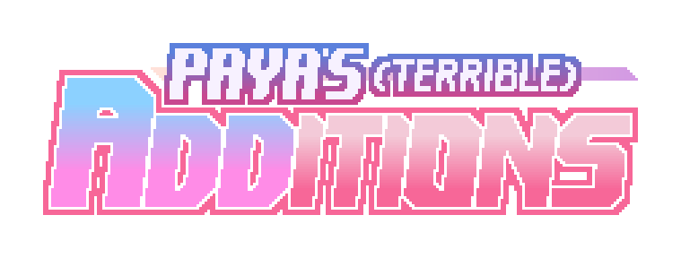
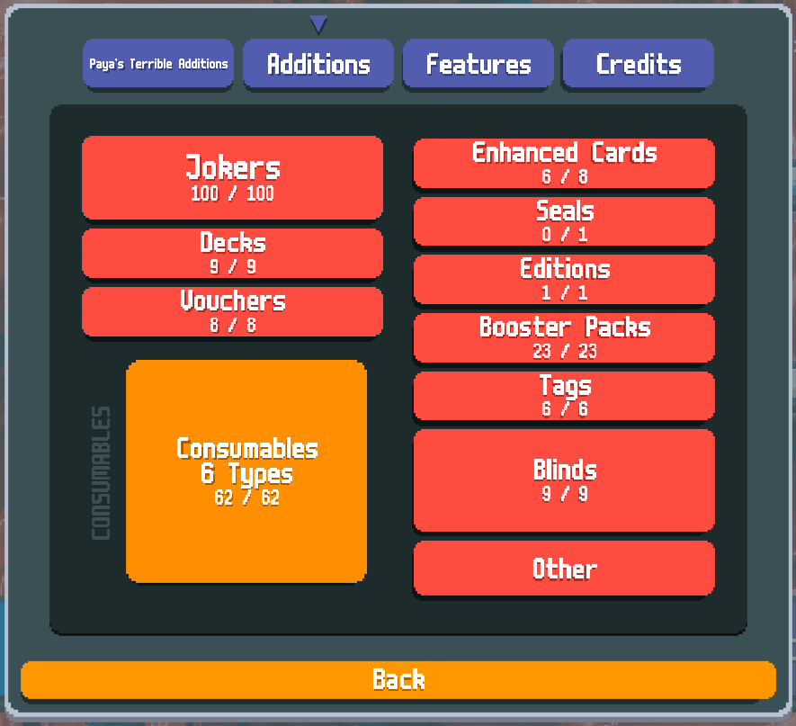

> [!NOTE]
> This mod is currently a work in progress! 
> Also this mod has various references to Blue Archive, Monopoly, DOS, and other bullshit I like.

# Paya's Terrible Additions

A terrible mod that adds whatever I want to Balatro and other stuff.

Requires latest Steamodded.

## The 'Additions' in question

- 80+ new Jokers!
- New consumables, both old and new types!
- New vouchers, blinds, boosters, tags and decks!
- New card modifiers!
- New mechanics! (If you call new currency a mechanic)
- An acceptable amount of cross-mod content, with well known mods as "Crypted" and "Ortlab"
- Not compatible with The Mod Formerly Known As Jen's Almanac

## License

This mod is under the [GNU General Public License](https://www.gnu.org/licenses/gpl-3.0.html).